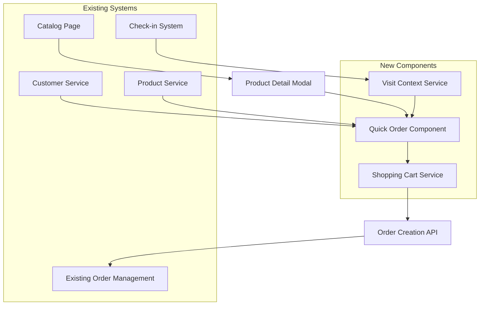
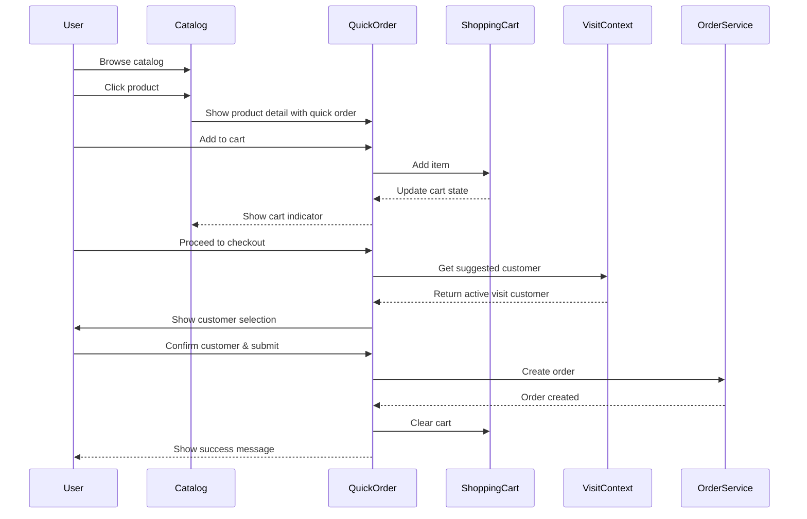
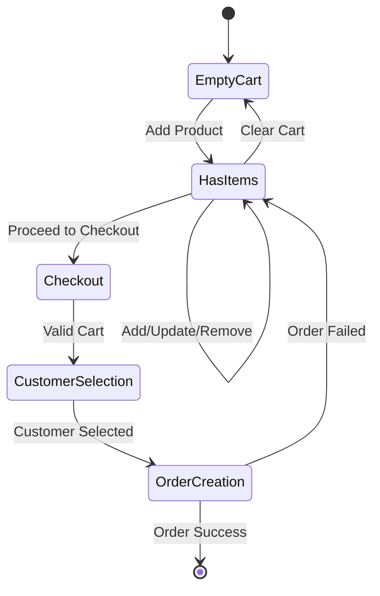

# Design Document: Quick Order dari Katalog

## Overview

Fitur Quick Order dari Katalog mengintegrasikan sistem pemesanan langsung ke dalam katalog produk, memungkinkan sales employee untuk membuat order dengan efisiensi maksimal. Sistem ini mengurangi friction dalam proses penjualan dengan auto-fill data produk, smart customer detection, dan shopping cart functionality.

## Architecture

### High-Level Architecture



### Component Integration

1. **Catalog Enhancement**: Menambahkan quick order functionality ke existing catalog
2. **Cart Management**: New service untuk mengelola shopping cart state
3. **Visit Context**: Service untuk detect active customer visits
4. **Order Bridge**: Connector ke existing order system

## Components and Interfaces

### 1. QuickOrderManager

**Purpose**: Orchestrates the entire quick order workflow

```javascript
class QuickOrderManager {
  constructor() {
    this.cart = new ShoppingCart();
    this.visitContext = new VisitContextService();
    this.orderService = new OrderService();
  }

  // Add product to cart from catalog
  async addProductToCart(productId, quantity = 1) {
    const product = await this.getProductDetails(productId);
    return this.cart.addItem(product, quantity);
  }

  // Get suggested customer (from active visit or manual selection)
  async getSuggestedCustomer() {
    const activeVisit = await this.visitContext.getActiveVisit();
    return activeVisit ? activeVisit.customer : null;
  }

  // Complete order with current cart
  async completeOrder(customerId, notes = '') {
    const cartItems = this.cart.getItems();
    const orderData = this.buildOrderData(cartItems, customerId, notes);
    
    const result = await this.orderService.createOrder(orderData);
    if (result.success) {
      this.cart.clear();
    }
    return result;
  }
}
```

### 2. ShoppingCart Service

**Purpose**: Manages cart state and operations

```javascript
class ShoppingCart {
  constructor() {
    this.items = [];
    this.listeners = [];
  }

  addItem(product, quantity) {
    const existingItem = this.findItem(product.id);
    
    if (existingItem) {
      existingItem.quantity += quantity;
    } else {
      this.items.push({
        id: product.id,
        name: product.name,
        price: product.price,
        image_url: product.image_url,
        quantity: quantity
      });
    }
    
    this.notifyListeners();
    return this.getTotal();
  }

  removeItem(productId) {
    this.items = this.items.filter(item => item.id !== productId);
    this.notifyListeners();
  }

  updateQuantity(productId, quantity) {
    const item = this.findItem(productId);
    if (item) {
      if (quantity <= 0) {
        this.removeItem(productId);
      } else {
        item.quantity = quantity;
        this.notifyListeners();
      }
    }
  }

  getTotal() {
    return this.items.reduce((total, item) => 
      total + (item.price * item.quantity), 0
    );
  }

  getItemCount() {
    return this.items.reduce((count, item) => count + item.quantity, 0);
  }

  clear() {
    this.items = [];
    this.notifyListeners();
  }
}
```

### 3. VisitContextService

**Purpose**: Detects and manages active customer visits

```javascript
class VisitContextService {
  async getActiveVisit() {
    const user = state.getState('user');
    const today = new Date().toISOString().split('T')[0];
    
    // Get today's attendance records without check-out
    const { data: activeVisits } = await db.supabase
      .from('attendance')
      .select('*, customers(*)')
      .eq('employee_id', user.id)
      .gte('check_in_time', `${today}T00:00:00`)
      .is('check_out_time', null)
      .order('check_in_time', { ascending: false })
      .limit(1);
    
    return activeVisits?.[0] || null;
  }

  async getRecentCustomers(limit = 5) {
    const user = state.getState('user');
    
    // Get recently visited customers
    const { data: recentVisits } = await db.supabase
      .from('attendance')
      .select('customer_id, customers(*)')
      .eq('employee_id', user.id)
      .order('check_in_time', { ascending: false })
      .limit(limit);
    
    return recentVisits?.map(v => v.customers) || [];
  }
}
```

### 4. Enhanced Product Detail Modal

**Purpose**: Adds quick order functionality to existing product modal

```javascript
function enhanceProductModal(product) {
  const existingModal = showProductDetail(product.id);
  
  // Add quick order section to modal
  const quickOrderSection = `
    <div class="quick-order-section mt-lg border-top pt-lg">
      <h4 class="mb-md">🛒 Pesan Produk Ini</h4>
      
      <div class="form-group">
        <label class="form-label">Jumlah</label>
        <div class="quantity-selector flex items-center gap-sm">
          <button type="button" class="btn btn-outline btn-small" id="qty-minus">-</button>
          <input type="number" id="product-quantity" class="form-input text-center" value="1" min="1" style="width: 80px;">
          <button type="button" class="btn btn-outline btn-small" id="qty-plus">+</button>
        </div>
      </div>
      
      <div class="flex gap-sm">
        <button class="btn btn-primary flex-1" id="add-to-cart-btn">
          <span>🛒</span>
          <span>Tambah ke Keranjang</span>
        </button>
        <button class="btn btn-outline" id="quick-order-btn">
          <span>⚡</span>
          <span>Order Langsung</span>
        </button>
      </div>
    </div>
  `;
  
  // Insert before modal footer
  const modalBody = existingModal.querySelector('.modal-body');
  modalBody.insertAdjacentHTML('beforeend', quickOrderSection);
  
  // Attach event listeners
  setupQuickOrderEvents(product);
}
```

## Data Models

### Enhanced Cart Item Model

```javascript
const CartItem = {
  id: 'string',           // Product ID
  name: 'string',         // Product name
  price: 'number',        // Unit price
  quantity: 'number',     // Quantity in cart
  image_url: 'string',    // Product image
  added_at: 'timestamp',  // When added to cart
  source: 'string'        // 'catalog' | 'manual'
};
```

### Quick Order Context

```javascript
const QuickOrderContext = {
  cart_items: 'CartItem[]',
  suggested_customer: 'Customer | null',
  active_visit: 'Visit | null',
  session_id: 'string',
  created_at: 'timestamp'
};
```

### Enhanced Order Model

```javascript
const EnhancedOrder = {
  // Existing fields
  ...existingOrderFields,
  
  // New fields for quick order tracking
  order_source: 'string',     // 'quick_order' | 'manual'
  cart_session_id: 'string',  // Link to cart session
  visit_context_id: 'string', // Link to visit if applicable
  creation_method: 'string'   // 'catalog_direct' | 'cart_checkout'
};
```

## User Interface Design

### 1. Enhanced Catalog Grid

```html
<!-- Each product card gets enhanced with cart indicator -->
<div class="product-card" data-product-id="${product.id}">
  <!-- Existing product display -->
  
  <!-- New: Cart indicator overlay -->
  <div class="cart-indicator ${inCart ? 'visible' : 'hidden'}">
    <span class="cart-badge">${cartQuantity}</span>
  </div>
  
  <!-- New: Quick add button -->
  <button class="quick-add-btn" onclick="quickAddToCart('${product.id}')">
    <span>+</span>
  </button>
</div>
```

### 2. Floating Cart Summary

```html
<!-- Floating cart that appears when items are added -->
<div class="floating-cart ${cartItems.length > 0 ? 'visible' : 'hidden'}">
  <div class="cart-summary">
    <span class="cart-count">${totalItems} item</span>
    <span class="cart-total">${formatCurrency(totalAmount)}</span>
  </div>
  <button class="btn btn-primary btn-small" onclick="openCartModal()">
    Lihat Keranjang
  </button>
</div>
```

### 3. Cart Modal

```html
<div class="cart-modal">
  <div class="modal-header">
    <h3>🛒 Keranjang Belanja</h3>
    <span class="item-count">${totalItems} produk</span>
  </div>
  
  <div class="cart-items">
    <!-- Cart items list with quantity controls -->
  </div>
  
  <div class="cart-footer">
    <div class="total-section">
      <span class="total-label">Total:</span>
      <span class="total-amount">${formatCurrency(total)}</span>
    </div>
    
    <div class="action-buttons">
      <button class="btn btn-outline" onclick="clearCart()">Kosongkan</button>
      <button class="btn btn-primary" onclick="proceedToCheckout()">Checkout</button>
    </div>
  </div>
</div>
```

### 4. Smart Customer Selection

```html
<div class="customer-selection">
  <!-- Active visit customer (if any) -->
  <div class="suggested-customer ${activeVisit ? 'visible' : 'hidden'}">
    <div class="customer-card active-visit">
      <div class="customer-info">
        <h4>${activeVisit?.customer?.name}</h4>
        <p>📍 Sedang dikunjungi</p>
      </div>
      <button class="btn btn-primary btn-small" onclick="selectCustomer('${activeVisit?.customer?.id}')">
        Pilih
      </button>
    </div>
  </div>
  
  <!-- Other customer options -->
  <div class="other-customers">
    <button class="btn btn-outline w-full" onclick="showCustomerSelector()">
      👥 Pilih Pelanggan Lain
    </button>
  </div>
</div>
```

## Workflow Diagrams

### Quick Order from Catalog Flow



### Cart Management Flow



## Performance Considerations

### 1. Cart State Management

- **Local Storage Persistence**: Cart state disimpan di localStorage untuk survive page refresh
- **Memory Optimization**: Hanya store essential product data di cart
- **Lazy Loading**: Product details di-fetch on-demand saat dibutuhkan

### 2. Network Optimization

- **Batch Operations**: Multiple cart operations di-batch untuk reduce API calls
- **Optimistic Updates**: UI update immediately, sync dengan server di background
- **Offline Support**: Cart operations work offline, sync when connection restored

### 3. Mobile Performance

- **Touch Optimization**: Large touch targets, smooth animations
- **Viewport Management**: Smart keyboard handling, scroll position maintenance
- **Image Optimization**: Lazy load product images, use appropriate sizes

## Security Considerations

### 1. Cart Validation

- **Server-side Validation**: All cart contents validated on server before order creation
- **Price Integrity**: Product prices verified against current catalog prices
- **Quantity Limits**: Enforce reasonable quantity limits per product

### 2. Session Management

- **Cart Session Expiry**: Cart sessions expire after reasonable time
- **User Association**: Cart tied to authenticated user session
- **CSRF Protection**: All cart operations protected against CSRF

### 3. Data Privacy

- **Customer Data**: Customer selection respects existing privacy policies
- **Order History**: Quick order history follows same retention policies
- **Analytics**: User behavior tracking follows privacy guidelines

## Error Handling

### 1. Network Errors

```javascript
class NetworkErrorHandler {
  async handleCartOperation(operation) {
    try {
      return await operation();
    } catch (error) {
      if (error.name === 'NetworkError') {
        // Queue operation for retry
        this.queueForRetry(operation);
        return { success: false, queued: true };
      }
      throw error;
    }
  }
}
```

### 2. Validation Errors

- **Product Availability**: Check product availability before adding to cart
- **Price Changes**: Handle price changes between cart and checkout
- **Customer Validation**: Verify customer exists and is accessible

### 3. User Experience Errors

- **Clear Messaging**: Specific error messages for different failure scenarios
- **Recovery Options**: Provide clear paths to recover from errors
- **Graceful Degradation**: Fallback to manual order creation if quick order fails

## Testing Strategy

### 1. Unit Tests

- **Cart Operations**: Add, remove, update, clear functionality
- **Price Calculations**: Total calculation accuracy
- **State Management**: Cart state persistence and restoration

### 2. Integration Tests

- **Order Creation**: End-to-end order creation from cart
- **Customer Integration**: Visit context and customer selection
- **Catalog Integration**: Product addition from catalog

### 3. Performance Tests

- **Cart Response Time**: Cart operations under 500ms
- **Catalog Loading**: Product data loading under 2s
- **Order Submission**: Complete order flow under 5s

### 4. Mobile Tests

- **Touch Interactions**: All touch targets accessible and responsive
- **Viewport Handling**: Proper behavior across different screen sizes
- **Offline Functionality**: Cart operations work without network

## Migration Strategy

### Phase 1: Core Cart Functionality
- Implement ShoppingCart service
- Add basic cart UI components
- Integrate with existing catalog

### Phase 2: Smart Customer Selection
- Implement VisitContextService
- Add customer suggestion logic
- Integrate with check-in system

### Phase 3: Enhanced UX
- Add floating cart summary
- Implement advanced cart management
- Add analytics and reporting

### Phase 4: Optimization
- Performance optimizations
- Offline support
- Advanced error handling

## Correctness Properties

*A property is a characteristic or behavior that should hold true across all valid executions of a system-essentially, a formal statement about what the system should do. Properties serve as the bridge between human-readable specifications and machine-verifiable correctness guarantees.*

### Property 1: Product Data Consistency
*For any* product in the catalog, when added to cart or order, the product name, price, and image URL should remain identical to the original catalog data
**Validates: Requirements 1.2, 1.4**

### Property 2: Cart State Management
*For any* sequence of cart operations (add, remove, update, navigate), the cart state should be preserved and accurately reflect all operations performed
**Validates: Requirements 3.1, 3.5, 4.2**

### Property 3: Duplicate Product Handling
*For any* product added multiple times to the cart, the system should increase quantity rather than create duplicate entries
**Validates: Requirements 3.2**

### Property 4: Cart Total Calculation
*For any* cart contents, the total amount should always equal the sum of (quantity × price) for all items in the cart
**Validates: Requirements 3.3, 5.2**

### Property 5: Customer Context Detection
*For any* employee with an active check-in, the system should automatically suggest the currently visited customer for order creation
**Validates: Requirements 2.1**

### Property 6: UI State Consistency
*For any* cart state (empty, has items, specific products), the UI indicators, buttons, and displays should accurately reflect the current cart contents
**Validates: Requirements 3.6, 4.1, 4.3, 4.5**

### Property 7: Comprehensive Validation
*For any* order submission attempt, the system should validate all required fields (customer, products, quantities) and provide specific error messages for missing or invalid data
**Validates: Requirements 2.5, 5.3, 8.1, 8.3**

### Property 8: Cart Operations Functionality
*For any* product in the cart, quantity modification and item removal operations should work correctly and update the cart state appropriately
**Validates: Requirements 3.4**

### Property 9: Order Creation Integration
*For any* order created through quick order, it should have the same format, trigger the same notifications, and integrate with the same tracking system as manually created orders
**Validates: Requirements 7.1, 7.2, 7.5**

### Property 10: Post-Order Cleanup
*For any* successful order submission, the system should clear the cart, show confirmation, and provide options for creating additional orders
**Validates: Requirements 5.5, 5.6**

### Property 11: Offline Functionality
*For any* cached product data, the system should allow cart operations and queue order submissions when offline, syncing when network is restored
**Validates: Requirements 6.3, 6.4**

### Property 12: Error Recovery
*For any* error condition (network failure, validation error, cart invalidation), the system should provide clear explanations and actionable recovery options
**Validates: Requirements 8.2, 8.4**

### Property 13: Duplicate Prevention
*For any* order submission, the system should prevent duplicate submissions through proper state management and user feedback
**Validates: Requirements 8.5**

### Property 14: Mobile Responsiveness
*For any* mobile device interaction (screen orientation, keyboard appearance, touch gestures), the system should maintain usability and proper layout
**Validates: Requirements 9.2, 9.3, 9.4, 9.5**

### Property 15: Analytics Tracking
*For any* user interaction with the quick order system, appropriate analytics data should be logged including timing, method, and outcome
**Validates: Requirements 10.1, 10.2, 10.3, 10.4**

## Monitoring and Analytics

### 1. Usage Metrics

- **Cart Conversion Rate**: Percentage of carts that become orders
- **Average Cart Size**: Number of items per cart
- **Time to Order**: Time from first cart addition to order completion

### 2. Performance Metrics

- **Cart Operation Latency**: Response time for cart operations
- **Order Creation Success Rate**: Percentage of successful order submissions
- **Error Rates**: Frequency and types of errors encountered

### 3. Business Metrics

- **Sales Efficiency**: Comparison of quick order vs manual order times
- **Product Popularity**: Most frequently added products via quick order
- **Customer Engagement**: Usage patterns by customer type and visit context